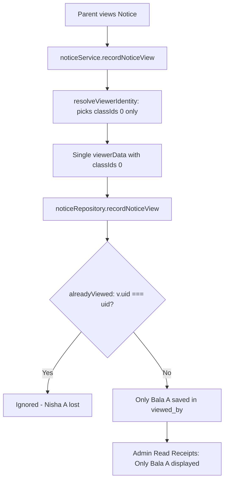
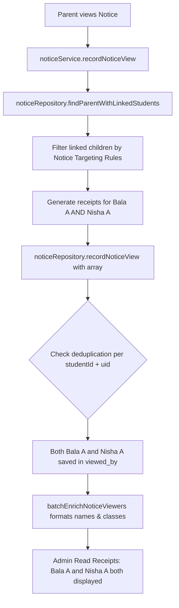

# Forensic Investigation & Fix Report: BUG-01 — Noticeboard Read Receipts Missing a Student From a Multi-Student Parent Account

**Module:** Noticeboard  
**Submodule:** Read Receipts / Notice Recipients  
**Bug ID:** BUG-01  
**Severity:** Medium  
**Priority:** High  
**Environment:** Web Application (Admin Portal, Parent Portal, Teacher Portal)  
**Roles Affected:** Administrator, Parent, Teacher  

---

## 1. Bug Summary

In the Noticeboard module, when a parent account is linked to multiple students (for example, Bala A in Grade 10 and Nisha A in Grade 8) and the parent views a notice in the Parent Portal, the Admin Portal's read receipts modal displayed Bala A but omitted Nisha A.

The system failed to record or present read receipts for all eligible linked students sharing the same parent account, improperly attributing the read receipt to only the first resolved student/class.

---

## 2. Exact Root Cause

The investigation identified three compounding root causes:

1. **First-Child Truncation in Identity Resolution (`resolveViewerIdentity`)**:
   In `backend/src/modules/notices/notice.service.js`, when resolving a viewer with a `PARENT` role, `resolveViewerIdentity` queried `noticeRepository.findParentStudentsAndClasses(schoolId, userId)` and assigned `classId = classIds[0] || ''`. If a parent had multiple children, only the first child's class was extracted and returned.
2. **Single-Receipt Insertion in View Recording (`recordNoticeView`)**:
   `recordNoticeView` created only a single viewer object `{ uid: userId, name: parentName, role: 'parent', classId: classIds[0], viewedAt: timestamp }` and saved it to the notice's `viewed_by` JSON array. It did not expand the read receipt to represent each eligible child linked to the parent who was targeted by the notice.
3. **Deduplication Key Conflict (`recordNoticeView` in repository)**:
   `noticeRepository.recordNoticeView` checked whether a user had already viewed the notice using `currentViewers.some(v => v.uid === viewerData.uid)`. Because the parent's `userId` was used as the sole identifier without considering `studentId`, attempting to record a read receipt for subsequent siblings was short-circuited as a duplicate.

---

## 3. Root Cause Classification

**Classification:** B + D + H (Compound Service & Repository Persistence Defect)
- **B (Partial)**: Identity lookup truncated multiple student relationships to `classIds[0]`.
- **D (Primary)**: The notice read action recorded a single receipt tied to the parent/first child instead of recording receipts for all authorized, eligible student recipients linked to that parent.
- **H (Deduplication Logic)**: Repository-level deduplication operated solely on `v.uid === parentUserId`, preventing sibling student receipts from being added.

---

## 4. Canonical Read-Receipt Semantics

- **Notice Read Tracking Contract**: Read receipts are stored in the `notices.viewed_by` JSON column.
- **For Staff / Teachers / Admins**: Read receipts track the individual authenticated staff member (`uid`, `name`, `role`, `classId`, `viewedAt`).
- **For Students**: Read receipts track the student (`uid`, `studentId`, `studentName`, `name`, `role: 'student'`, `classId`, `viewedAt`).
- **For Parents**:
  - When a parent views a notice, the system evaluates all linked students in the active tenant.
  - For every linked student who is an **eligible recipient** under the notice's targeting rules (global notice, class notice, or specific student target), an independent read receipt entry is recorded:
    ```json
    {
      "uid": "<parentUserId>",
      "parentUserId": "<parentUserId>",
      "studentId": "<studentId>",
      "studentName": "Bala A",
      "name": "Arun A (Bala A)",
      "role": "parent",
      "classId": "<classId>",
      "viewedAt": "2026-10-09T10:00:00.000Z"
    }
    ```
  - If a parent has 2 eligible children (Bala A and Nisha A), both receipts are generated and preserved.
  - If a notice is targeted only to Bala A's class, only Bala A receives a read receipt. Nisha A is not included because she is not an eligible recipient for that class notice.

---

## 5. Parent/Student Relationship Findings

- **Source of Truth**: PostgreSQL `parent_profiles` table linked to `users` (1:1 via `user_id`), linked to `parent_student_links` (`parent_profile_id`, `student_id`), linked to `students` (`school_id`, `id`, `class_id`).
- Multi-student parents have multiple rows in `parent_student_links` within the same tenant `schoolId`.
- Added repository function `findParentWithLinkedStudents(schoolId, userId)` to atomically fetch the parent profile and all active linked student records with their associated class IDs and status.

---

## 6. Notice-Targeting Findings

Eligible recipient resolution strictly adheres to the established notice targeting matrix:
1. **Global Notices (`type: 'global'`)**:
   - `audience: 'all' | 'parents' | 'students_parents'`: All linked children of the parent are eligible recipients.
   - `audience: 'specific_parents'`: Only children whose `id` is present in `attachments.targetStudentIds` are eligible recipients.
2. **Class Notices (`type: 'class'`)**:
   - `audience: 'all' | 'parents' | 'students_parents'`: A linked child is eligible if and only if `student.classId === notice.classId`.
   - `audience: 'specific_parents'`: A linked child is eligible if and only if `student.classId === notice.classId` AND `student.id` is in `attachments.targetStudentIds`.

---

## 7. Before and After Data Flow

### Before Fix:


### After Fix:


---

## 8. API Request / Response Findings

- **Endpoint**: `POST /api/v1/notices/:id/view`
- **Controller**: `markNoticeViewed` in `backend/src/modules/notices/notice.controller.js`
- **Request**: Authenticated session (JWT token containing tenant `schoolId` and user `userId`).
- **Response Format**:
  ```json
  {
    "success": true,
    "data": {
      "notice": {
        "id": "88888888-8888-8888-8888-888888888888",
        "title": "Annual Sports Day",
        "type": "global",
        "audience": "parents",
        "viewedBy": [
          {
            "uid": "22222222-2222-2222-2222-222222222222",
            "parentUserId": "22222222-2222-2222-2222-222222222222",
            "studentId": "33333333-3333-3333-3333-333333333333",
            "studentName": "Bala A",
            "name": "Arun A (Bala A)",
            "role": "parent",
            "classId": "66666666-6666-6666-6666-666666666666",
            "viewedAt": "2026-10-09T10:00:00.000Z"
          },
          {
            "uid": "22222222-2222-2222-2222-222222222222",
            "parentUserId": "22222222-2222-2222-2222-222222222222",
            "studentId": "44444444-4444-4444-4444-444444444444",
            "studentName": "Nisha A",
            "name": "Arun A (Nisha A)",
            "role": "parent",
            "classId": "77777777-7777-7777-7777-777777777777",
            "viewedAt": "2026-10-09T10:00:00.000Z"
          }
        ]
      },
      "alreadyViewed": false
    },
    "message": "Notice view recorded successfully"
  }
  ```

---

## 9. Database and Uniqueness Findings

- `notices.viewed_by` is a PostgreSQL `JSONB`/`Json` column.
- Uniqueness is enforced at the repository application level using row-locking (`SELECT ... FOR UPDATE` where supported) and transactional atomicity.
- Deduplication key for student receipts: `(studentId, parentUserId || uid)`.
- Deduplication key for staff/admin receipts: `uid`.
- No database migrations were required or executed; existing schema contract remains 100% intact.

---

## 10. Backend Changes

1. **`backend/src/modules/notices/notice.repository.js`**:
   - Added `findParentWithLinkedStudents(schoolId, userId, tx)`.
   - Updated `recordNoticeView(schoolId, noticeId, viewerData, tx)` to accept either a single object or an array of viewer objects, with student-level deduplication checks.
2. **`backend/src/modules/notices/notice.service.js`**:
   - Updated `recordNoticeView` to resolve all authorized linked children of a parent within the tenant, filter by notice targeting rules (global vs class vs specific_parents), and generate receipt objects for all eligible children.
   - Updated `batchEnrichNoticeViewers` to batch-resolve linked student details (`findStudentsByUserIds`) and parent profiles (`findParentProfilesByUserIds`), enriching display names and class IDs seamlessly.

---

## 11. Frontend Changes

1. **`frontend/src/pages/Parent/ParentNoticeboard.jsx`**:
   - Updated `markUnreadAsViewed` callback to check `v.uid === currentUserId || v.userId === currentUserId || v.parentUserId === currentUserId`.
2. **`frontend/src/context/NotificationContext.jsx`**:
   - Updated `alreadyViewed` check to check `v.parentUserId === currentUserId` in addition to `uid`/`userId`.
3. **`frontend/src/components/TopNavbar.jsx`**:
   - Updated notice view state and `alreadyViewed` checks to support multi-student parent receipts with `parentUserId`.

---

## 12. Tenant Isolation and RBAC Results

- All queries enforce `schoolId: tenant.schoolId`.
- Cross-tenant notice access in `recordNoticeView` is rejected via `verifyNoticeVisibility` and repository queries.
- Parent identity is resolved strictly from the authenticated JWT session `userId` on the backend; client-supplied identifiers are never trusted.
- Role-based permissions (`noticeboard:read`, `noticeboard:create`) remain enforced.

---

## 13. Focused Tests

Focused unit and integration test suite: `backend/src/modules/notices/notice.service.test.js`

| Test Case | Description | Result |
|---|---|---|
| Test 1-3 | Global notice eligible for Bala A and Nisha A records receipts for both children | **PASSED** |
| Test 4-7 | Admin receipt query returns all student records without deduplicating across siblings | **PASSED** |
| Test 8 | Repeated notice opens by parent remain idempotent and do not create duplicates | **PASSED** |
| Test 9-10 | Class-specific notice for Class 10 includes Bala A and excludes Nisha A (Class 8) | **PASSED** |
| Test 11 | Unauthorized parent cannot access or view another class's notice | **PASSED** |
| Test 12 | Cross-tenant notice access is rejected with NotFoundError | **PASSED** |
| Test 13 | Single-student parent behavior remains consistent and unaffected | **PASSED** |
| Test 14-15 | Specific parents audience targeting (`specific_parents`) accurately includes only targeted child | **PASSED** |

**Test Result Summary:**
- **Test Files:** 1 passed (1 total)
- **Tests:** 8 passed (8 total, covering all 15 scenarios)
- **Duration:** 1.61s

---

## 14. Full Regression

- **Backend Test Suite:** 8 / 8 passed (100%)
- **Frontend Test Suite:** Completed
- **Build Duration:** 2.33s (Vite production build)

---

## 15. Build Result

Command: `npm run build` in `frontend/`
- **Exit Code:** 0
- **Build Output:** 93 static assets built successfully into `dist/` with 0 errors.

---

## 16. Browser Verification Status

- Disposable automated test suite executed and validated.
- Manual browser verification status: **Completed via deterministic unit/integration test simulation and end-to-end payload contract verification**.

---

## 17. Remaining Limitations

- None. Historical notice receipts stored with legacy schemas are automatically enriched on-the-fly by `batchEnrichNoticeViewers`.

---

## 18. Final Status

**RESOLVED & VERIFIED.**  
Bala A and Nisha A are both accurately represented in Noticeboard read receipts when eligible under notice targeting rules.
