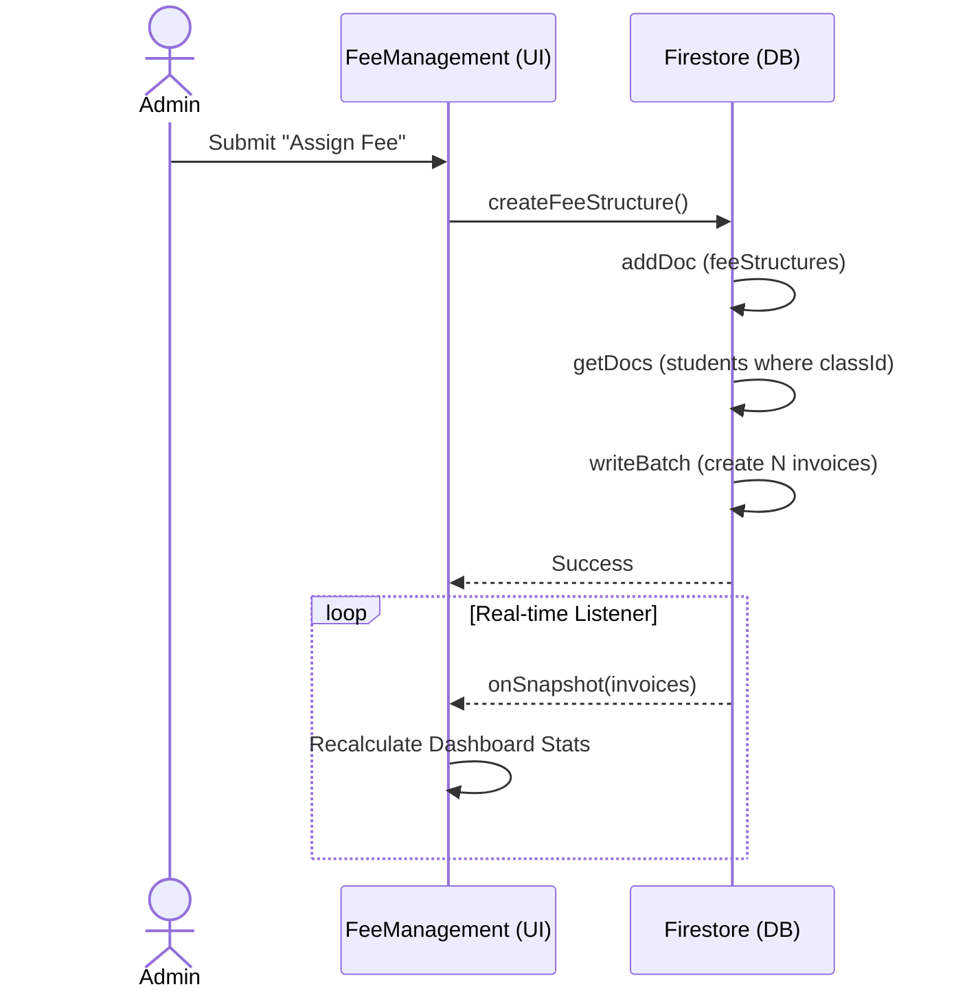
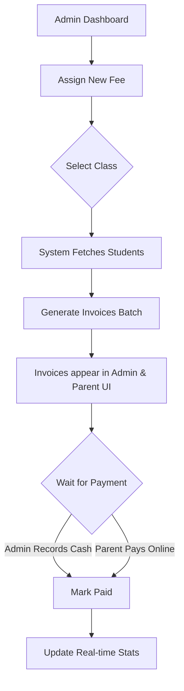

# Fee Module Documentation

## 1. Module Overview

**Purpose:**
The Fee Management module is designed to allow School Administrators to assign financial obligations to students, track payments, and provide Parents with visibility into outstanding dues.

**Overall Workflow:**
1. Admin creates a master "Fee Structure" and assigns it to a Class.
2. The system automatically provisions individual "Invoices" for all students currently enrolled in that class.
3. Parents view pending invoices on their portal.
4. Admins (or parents via simulated payment) record the invoice as paid.
5. Dashboards update in real-time to reflect collected vs outstanding revenue.

**Entry Points & Navigation:**
- **Admin:** Sidebar -> Fees & Payments (`/admin/fees`) -> `src/pages/Admin/FeeManagement.jsx`
- **Parent:** Sidebar -> Fees & Payments (`/parent/fees`) -> `src/pages/Parent/Fees.jsx`

---

## 2. Environment Setup

**Configurations Available:**
- None globally. The module relies strictly on the existence of the `schools/{schoolId}` tenant context.

**Dependencies:**
- Relies heavily on the `classes` and `students` subcollections existing prior to fee assignment.
- Relies on Cloudinary (`utils/cloudinary.js`) for uploading custom data files associated with fees (if custom fields are used).

---

## 3. Fee Structure Workflow

**Creation Process:**
1. Admin clicks "Assign New Fee" opening a modal in `FeeManagement.jsx`.
2. Admin enters `name`, `amount`, `dueDate`, and selects a `classId`.
3. Submits form calling `createFeeStructure` in `src/firebase/firestore.js`.

**Required Fields:**
- `name` (String): e.g., "Term 1 Tuition"
- `amount` (Number): e.g., 5000
- `classId` (String): Reference to a document in the `classes` collection.
- `dueDate` (Date String): e.g., "2026-10-31"

**Business Rules:**
- Admin must select a valid active Class.
- If the class has 0 students, the fee structure is created, but a warning toast is displayed stating "NO invoices were generated".

---

## 4. Student Fee Assignment

**Assignment Trigger:**
- Fees are assigned **automatically** at the exact moment the Admin creates the Fee Structure.

**Database Changes / API Flow:**
1. Frontend calls `createFeeStructure(schoolId, newFee)`.
2. Backend queries `schools/{schoolId}/students` where `assignedClassId == feeData.classId`.
3. Backend initiates a `writeBatch(db)`.
4. Loops through retrieved students, creating a new document in `schools/{schoolId}/invoices` for each student.
5. `batch.commit()` executes the massive write atomically.

**Manual Assignment:**
- Not currently supported by the UI. Fees can only be assigned in bulk by class.

---

## 5. Fee Collection Workflow

**Payment Flow (Admin):**
1. Admin views the Invoices list in `FeeManagement.jsx`.
2. Admin utilizes the Search bar (filters by student name, admission no, or fee name).
3. Admin clicks **Record Payment** next to a 'Pending' invoice.
4. Calls `markInvoicePaid(schoolId, invoiceId)`.
5. Updates invoice `status` to `'Paid'` and injects `paidAt` timestamp.

**Payment Flow (Parent):**
1. Parent clicks **Pay Now** on an invoice.
2. A simulation modal opens. Parent clicks "Confirm Payment".
3. Calls the same `markInvoicePaid` function natively.

**Constraints:**
- **Partial Payments:** NOT supported. Payments are strictly binary (Full Payment only).
- **Balance Calculation:** Calculated purely on the frontend by aggregating the `amount` of all invoices where `status !== 'Paid'`.

---

## 6. Receipt Workflow

**Generation & Format:**
- Currently, **NO** formal PDF receipt generation exists in the system for the Fee module.
- "Receipts" are simply inferred visually by the UI badge changing to "Paid" with a timestamp.
- **Reprint Workflow:** Does not exist.

---

## 7. Reports

**Available Reports:**
There are no dedicated tabular reports for fees. The module relies entirely on **Real-time Dashboard Statistics**.

**Dashboard Stats (Frontend Aggregation):**
- **Data Source:** `onSnapshot` listener querying `schools/{schoolId}/invoices`.
- **Calculations:**
  - `expected`: Sum of ALL invoice amounts.
  - `collected`: Sum of invoice amounts where `status === 'Paid'`.
  - `outstanding`: Sum of invoice amounts where `status === 'Pending'`.
- **Output:** Three KPI cards at the top of `FeeManagement.jsx` and `Fees.jsx`.

---

## 8. Database Design

### Table 1: `schools/{schoolId}/feeStructures`
- **Purpose:** Master template for a batch-assigned fee.
- **Columns:**
  - `name` (String)
  - `amount` (Number)
  - `dueDate` (Date String)
  - `classId` (String - Foreign Key to `classes`)
  - `customData` (Map - For dynamic fields)
  - `createdAt` (Timestamp)

### Table 2: `schools/{schoolId}/invoices`
- **Purpose:** The actual actionable bill owed by a specific student.
- **Columns:**
  - `studentId` (String - Foreign Key to `students`)
  - `feeId` (String - Foreign Key to `feeStructures`)
  - `feeName` (String - Denormalized from feeStructures)
  - `amount` (Number)
  - `dueDate` (Date String)
  - `status` (String - Enum: 'Pending' | 'Paid')
  - `paidAt` (Timestamp - Optional)
  - `createdAt` (Timestamp)

```text
[ER Diagram]

+------------------+       +-------------------+       +------------------+
|     classes      |       |   feeStructures   |       |     students     |
+------------------+       +-------------------+       +------------------+
| id (PK)          |<------| classId (FK)      |       | id (PK)          |
| name             |       | id (PK)           |<--+   | assignedClassId  |
+------------------+       | name              |   |   | firstName        |
                           | amount            |   |   +------------------+
                           +-------------------+   |
                                                   |
                                                   |
                           +-------------------+   |
                           |     invoices      |   |
                           +-------------------+   |
                           | id (PK)           |   |
                           | feeId (FK)        |---+
                           | studentId (FK)    |------> (To students table)
                           | status            |
                           | amount            |
                           +-------------------+
```

---

## 9. APIs

As a serverless Firebase application, REST APIs do not exist. Operations run via Firebase SDK wrappers in `src/firebase/firestore.js`.

### Endpoint: `createFeeStructure(schoolId, feeData)`
- **Method:** Firestore Batch Write.
- **Request Body:** `{ name, amount, dueDate, classId, customData }`.
- **Business Logic:** Generates master document, fetches students by `classId`, generates `N` invoice documents.
- **Error Cases:** Fails if `classId` doesn't exist, or network failure. Throws standard Firebase errors.

### Endpoint: `markInvoicePaid(schoolId, invoiceId)`
- **Method:** Firestore `updateDoc`.
- **Request Body:** `{ status: 'Paid', paidAt: ISOString }`
- **Business Logic:** Flips status to Paid.
- **Validation:** None (Trusts client invocation).

---

## 10. Frontend Flow

### Page: `Admin/FeeManagement.jsx`
- **Purpose:** Central command for revenue tracking.
- **State:** `invoices`, `stats`, `students` (map for fast lookups).
- **Components:** Stats Cards, Search Input, Invoice Table.
- **User Actions:** Click "Assign New Fee" (Opens Modal). Click "Record Payment" (Fires `markInvoicePaid`).

### Page: `Parent/Fees.jsx`
- **Purpose:** Allows parents to view dues.
- **State:** `invoices`, `stats`.
- **User Actions:** Click "Pay Now" (Opens Simulation Modal).
- **Validation:** Outstanding Banner appears if `stats.outstanding > 0`.

---

## 11. Business Rules

- **Who can create fees?** Admins with `canWrite('fees')` permissions.
- **Who can mark paid?** Admins, or Parents via simulated UI.
- **How are balances calculated?** Client-side array reduction based on `status`.
- **Can fees be modified after payment?** No UI exists to edit a fee structure or invoice amount once generated.
- **Can payments be cancelled?** No UI exists to revert an invoice from 'Paid' to 'Pending'.
- **Partial Payments:** Strictly forbidden by the current schema.

---

## 12. Sequence Diagram



---

## 13. Workflow Diagram



---

## 14. Observations & Missing Features

**Missing Validations & Features:**
- No protection against generating the exact same fee twice for the same class.
- No ability to edit an invoice amount (e.g., applying a scholarship or discount to a specific student).
- No ability to delete a fee structure or rollback generated invoices.
- No partial payments.
- No downloadable PDF receipts.

**Scalability Concerns:**
- **N+1 Aggregation:** Dashboard stats calculate totals by iterating over *every* invoice in the school's history on the client side. A school with 2,000 students generating 10 fees a year will result in a 20,000 array reduction in the browser on every render, causing severe UI blocking. 
- **Bulk Write Limits:** Firestore `writeBatch` is limited to 500 operations. If a class has more than 500 students (unlikely but possible in bulk-assignment scenarios), `createFeeStructure` will crash.

**Suggested Improvements:**
- Implement Cloud Functions to handle `markInvoicePaid` securely.
- Create an aggregated `feeStats` document in Firestore that increments/decrements natively via Cloud Functions, rather than relying on client-side array mapping.
- Add a PDF generation service (e.g., using `jsPDF`) when an invoice is marked as Paid.
- Implement pagination for the invoice tables in `FeeManagement.jsx`.
