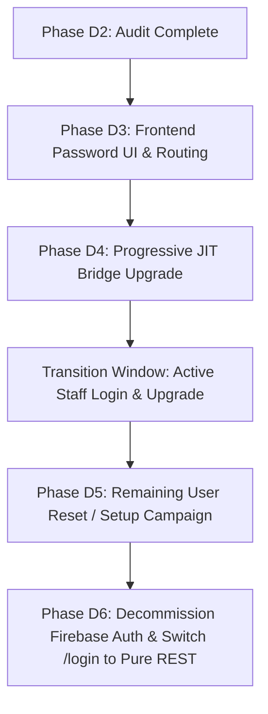

# FRONTEND.D2 — Institutional Password Migration Readiness Audit Report

**Date**: September 21, 2026  
**Auditor**: Antigravity Core Migration Engine  
**Status**: AUDIT ONLY — ZERO MUTATION VERIFIED  
**Context**: Transitioning Institutional Accounts from Firebase Auth to PostgreSQL Native REST Authentication  

---

## 1. Executive Summary

This audit establishes the comprehensive inventory, lifecycle mechanics, and technical migration blueprint required so that **every institutional user** can authenticate natively through PostgreSQL REST (`POST /api/v1/auth/login`) before Firebase Authentication is permanently decommissioned.

### Strict Audit Invariant Verification
- **0** authentication code modifications.
- **0** user records modified or created.
- **0** passwords changed, generated, or migrated.
- **0** emails or reset links dispatched.
- **0** Prisma migrations or schema edits executed.
- **0** changes made to `AuthContext.jsx`, `firebase/auth.js`, `LoginPage.jsx`, or `ForgotPassword.jsx`.

---

## 2. PostgreSQL User Population Census

A live read-only audit of all 686 user records across all school tenants (`SchoolS024`, `SchoolS015`, `SchoolS019`, and `SYSTEM_TEMPLATE`) reveals the following population taxonomy:

| Account Classification | Password Hash Marker / Pattern | Count | Active Status | Primary School Tenant | Current Authentication Method | Target Native Method |
| :--- | :--- | :---: | :---: | :--- | :--- | :--- |
| **Firebase-Managed Institutional Staff/Admin** | `!LOCKED_FIREBASE_AUTH_MANAGED` | **38** | 100% `true` | SchoolS024 (34)<br>SchoolS015 (4) | Firebase Auth SDK &rarr; `POST /auth/firebase-exchange` | Native REST `POST /auth/login` (Argon2id) |
| **Unprovisioned / Shadow Staff** | `!LOCKED_FUTURE_AUTH_REQUIRED` | **5** | 100% `true` | SchoolS024 (5) | None (Cannot log into Firebase or REST) | First-Time Password Setup (`POST /auth/password-setup/confirm`) |
| **Admission-Linked Parents** | `!LOCKED_PARENT_NO_DIRECT_AUTH` | **643** | 100% `true` | SchoolS024 (328)<br>SchoolS015 (315) | **Already REST Native**: `POST /auth/admission-login` | Remains `POST /auth/admission-login` |
| **Native PostgreSQL Password Users** | `$argon2id$...` | **0** (legacy) | N/A | N/A (Applies to C1 registered schools) | Native REST `POST /auth/login` | Native REST `POST /auth/login` |
| **Deactivated / Suspended Accounts** | `isActive = false` | **0** | `false` | None | N/A | N/A |
| **TOTAL** | | **686** | | | | |

### Detailed Breakdown by School & System Role

#### 1. Spring Mount Valley School (`SchoolS024` — `25e9637a-7fa4-4ac2-b43d-b4c0edcf2932`)
- **Total Users**: 367
- **`!LOCKED_FIREBASE_AUTH_MANAGED` (34 users)**:
  - 33 Teachers (`systemRole: TEACHER`, emails `@springmount.co.in`, e.g. `priyanka.s@springmount.co.in`, `abarna.m@springmount.co.in`).
  - 1 Administrator (`systemRole: ADMIN`, email `admin@springmount.co.in`).
  - All 34 possess verified Firestore Document IDs matching Firebase Auth UIDs in `legacyFirestoreId`.
- **`!LOCKED_FUTURE_AUTH_REQUIRED` (5 users)**:
  - 5 Teachers (`shihana@springmount.co.in`, `aishwarya.g@springmount.co.in`, `kaviya.r@springmount.co.in`, `muthulakshmi.s@springmount.co.in`, `ranjith.n@springmount.co.in`).
  - Present in Firestore staff collections but never had active Firebase Authentication user records provisioned.
- **`!LOCKED_PARENT_NO_DIRECT_AUTH` (328 users)**:
  - Parents with synthetic internal emails (`parent.<name>_<docId>@s024.sms.internal`).
  - Zero Firebase Auth dependency. Authenticate natively via Student Admission Number.

#### 2. TrustITec College (`SchoolS015` — `e2638de0-cf88-4cef-96db-74c353c6e43d`)
- **Total Users**: 319
- **`!LOCKED_FIREBASE_AUTH_MANAGED` (4 users)**:
  - 1 Tenant Admin (`pravin@globaltrustitec.com`).
  - 3 Tenant Users (`pavi@trustitec.com`, `001@parent.school.com`, `002@parent.school.com`).
  - Authenticated via Firebase email matching (`legacyFirestoreId` is `null`).
- **`!LOCKED_PARENT_NO_DIRECT_AUTH` (315 users)**:
  - Parents with synthetic SIS emails (`p_phone_<num>@s015.parent.local`).
  - Zero Firebase Auth dependency. Authenticate natively via Student Admission Number.

#### 3. Zuna International School (`SchoolS019`) & System Template
- **SchoolS019**: Status is `suspended`. Total users: 0.
- **SYSTEM_TEMPLATE**: Total users: 0.

---

## 3. Current Password Representation & Backend Lifecycle

### Database Representation (`schema.prisma`)
```prisma
model User {
  id                String   @id @default(uuid()) @db.Uuid
  schoolId          String?  @map("school_id") @db.Uuid
  email             String   @unique @db.VarChar(255)
  passwordHash      String   @map("password_hash") @db.VarChar(255)
  passwordAlgorithm String   @default("argon2id") @map("password_algorithm") @db.VarChar(50)
  systemRole        String   @default("TENANT_USER") @map("system_role") @db.VarChar(30)
  tokenVersion      Int      @default(1) @map("token_version")
  isActive          Boolean  @default(true) @map("is_active")
  legacyFirestoreId String?  @map("legacy_firestore_id") @db.VarChar(128)
  ...
}
```

### Password Locking Mechanics (`password.service.js`)
- Constant `AUTH_CONSTANTS.LOCKED_PASSWORD_PREFIX = '!LOCKED_'`.
- `isLockedPassword(hash)`: Evaluates whether `hash.startsWith('!LOCKED_')`.
- `verifyPassword(hash, password)`: Fast-fails immediately if `isLockedPassword(hash) === true`. Locked hashes never undergo Argon2id verification calculations.
- Complexity Policy: 8–128 characters, at least 1 uppercase, 1 lowercase, 1 digit. Treated as exact secrets (no trimming).

### Backend Authentication Behavior with Locked Accounts

| Backend Endpoint | Method | Behavior on `!LOCKED_*` Account | Status Code & Error Code |
| :--- | :---: | :--- | :--- |
| `/api/v1/auth/login` | `POST` | **Blocked**: Evaluates `isLockedPassword(user.passwordHash)` before credential check | `403 Forbidden` (`PASSWORD_NOT_SET`) |
| `/api/v1/auth/firebase-exchange` | `POST` | **Allowed**: Bypasses `passwordHash`; verifies Firebase ID token signature and maps identity via `legacyFirestoreId` or email | `200 OK` (Issues access token + refresh cookie; does **not** alter `passwordHash`) |
| `/api/v1/auth/admission-login` | `POST` | **Allowed**: Bypasses `passwordHash`; verifies Student admission number and school code | `200 OK` (Issues access token + refresh cookie) |
| `/api/v1/auth/change-password` | `POST` | **Blocked**: Requires valid existing password; locked accounts cannot execute password change | `403 Forbidden` (`PASSWORD_NOT_SET`) |
| `/api/v1/auth/password-reset/request` | `POST` | **Allowed**: Generates 256-bit SHA-256 hashed token (15m expiry) and queues transactional email | `200 OK` (Generic enumeration-safe response) |
| `/api/v1/auth/password-reset/confirm` | `POST` | **Allowed**: Verifies token; atomically hashes new password with Argon2id, overwrites `passwordHash`, increments `tokenVersion`, and invalidates all sessions | `200 OK` (**Unlocks account**) |
| `/api/v1/auth/password-setup/confirm` | `POST` | **Allowed**: Verifies 24-hour setup token; atomically sets Argon2id hash, increments `tokenVersion`, and invalidates all sessions | `200 OK` (**Unlocks account**) |

---

## 4. The Scrypt vs Argon2id Impedance Mismatch

A critical question is: *Why can we not simply export passwords from Firebase Auth and insert them into PostgreSQL?*

1. **Plaintext Impossibility**: Firebase Auth never exposes plaintext passwords via API or console.
2. **Hash Format Incompatibility**:
   - Firebase Auth hashes passwords using a modified Google Scrypt implementation (`scrypt-firebase`).
   - The parameters require the Firebase project's secret base64 signer key, salt separator, rounds (8), and memory cost (14).
   - PostgreSQL schema strictly mandates RFC 9106 Argon2id (`passwordAlgorithm = 'argon2id'`, 64MB memory, 3 iterations, 4 threads).
3. **Architectural Purity**:
   - Introducing Scrypt support to PostgreSQL would require maintaining two disparate hashing algorithms, custom native crypto bindings, and technical debt for legacy compatibility.
   - Instead, the transition must capture or establish RFC 9106 Argon2id credentials directly.

---

## 5. Current Frontend Gaps & Deficiencies

While the backend infrastructure for password transitions is 100% complete and verified, the frontend currently exhibits several major gaps:

### 1. `ForgotPassword.jsx` is Unmigrated
- `frontend/src/pages/ForgotPassword.jsx` currently contains legacy fallback code:
  - Attempts `fetch('/api/forgot-password')` (legacy serverless function).
  - Falls back to generating a Firebase reset link: `https://school-management-system-6a2c4.firebaseapp.com/__/auth/action?mode=resetPassword...`.
  - Attempts a direct Firestore write: `updateDoc(doc(db, 'users', userDoc.id), { lastPasswordResetAt: ... })`.
- It does **not** call the existing native REST method `authApi.passwordResetRequest({ email })`.

### 2. Missing Reset Password Page
- Backend dispatches reset emails pointing to:
  `${FRONTEND_URL}/reset-password?token=<64-char-hex-token>`
- There is **no `/reset-password` page or component** in `frontend/src/pages/`.
- There is **no `/reset-password` route** in `frontend/src/App.jsx`.

### 3. Missing Account Setup Page
- Backend dispatches setup emails pointing to:
  `${FRONTEND_URL}/setup-password?token=<64-char-hex-token>`
- There is **no `/setup-password` page or component** in `frontend/src/pages/`.
- There is **no `/setup-password` route** in `frontend/src/App.jsx`.

### 4. Unused Native Auth API Methods
- `frontend/src/api/auth.js` already provides:
  - `authApi.passwordResetRequest({ email })` &rarr; `POST /api/v1/auth/password-reset/request`
  - `authApi.passwordResetConfirm({ token, newPassword })` &rarr; `POST /api/v1/auth/password-reset/confirm`
- Neither method is currently called by any frontend UI component.

---

## 6. Migration Pathways: Transitioning to Native PostgreSQL Auth

To transition the **38 Firebase-managed institutional accounts** and **5 unprovisioned accounts** to PostgreSQL REST before Firebase Auth is removed, three viable technical strategies exist:

```
                               ┌────────────────────────────────────────────────────────┐
                               │   38 Institutional Users (!LOCKED_FIREBASE_AUTH_*)     │
                               └───────────────────────────┬────────────────────────────┘
                                                           │
             ┌─────────────────────────────────────────────┼─────────────────────────────────────────────┐
             │                                             │                                             │
             ▼                                             ▼                                             ▼
   [STRATEGY 1: Progressive JIT]                [STRATEGY 2: Reset Campaign]                  [STRATEGY 3: Forced Cutoff]
   - Seamless on next login                     - Out-of-band email reset                     - Admin generates setup links
   - Zero user friction                         - Uses /forgot-password                       - Ideal for 5 uncredentialed staff
   - Upgrades hash in PostgreSQL                - Self-serve or admin-batched                 - High administrative effort
   - Bypasses Firebase on login #2              - Requires user action                        - Guaranteed clean break
```

### Strategy 1: Progressive "Just-In-Time" (JIT) Credential Capture (Recommended Primary)
- **Concept**: Transparently upgrade user credentials during their next normal login through the hybrid bridge.
- **Execution Flow**:
  1. User enters institutional email and password on `/login`.
  2. The hybrid bridge authenticates with Firebase Auth via `signInWithEmailAndPassword`.
  3. Upon successful Firebase authentication, the client or backend enhances the exchange to submit `{ idToken, password }` or calls a specialized bridge upgrade endpoint `POST /api/v1/auth/migrate-password`.
  4. Backend verifies the Firebase ID token cryptographically, hashes the submitted plaintext password with RFC 9106 Argon2id, and atomically updates `User.passwordHash = newArgon2idHash`.
  5. The `!LOCKED_FIREBASE_AUTH_MANAGED` marker is removed.
  6. On the user's subsequent login, the client checks or attempts native `POST /api/v1/auth/login`. Since the account now has a valid `$argon2id$` hash, native login succeeds immediately!
- **Benefits**:
  - **Zero user friction**: No forced password resets, no email dependencies, no broken workflows.
  - Users migrate automatically through routine daily usage.

### Strategy 2: Self-Serve & Bulk Email Password Reset (Recommended Fallback)
- **Concept**: Enable standard email password reset for users who do not log in during the JIT window.
- **Execution Flow**:
  1. Modernize `ForgotPassword.jsx` to call `authApi.passwordResetRequest({ email })`.
  2. Implement `ResetPassword.jsx` and register `/reset-password` in `App.jsx`.
  3. All 38 institutional staff members possess verified institutional email domains (`@springmount.co.in`, `@trustitec.com`).
  4. Users receive a 15-minute secure reset token, submit their new password to `POST /api/v1/auth/password-reset/confirm`, and their account is unlocked with Argon2id.

### Strategy 3: Administrative Password Setup Invitation (Required for 5 Uncredentialed Staff)
- **Concept**: Address the 5 teachers who never had Firebase Auth (`!LOCKED_FUTURE_AUTH_REQUIRED`).
- **Execution Flow**:
  1. Implement `SetupPassword.jsx` and register `/setup-password` in `App.jsx`.
  2. School Administrator or SuperAdmin issues a 24-hour setup token via the Admin Staff Management interface.
  3. Staff member receives invitation link (`/setup-password?token=...`) and configures their initial password via `POST /api/v1/auth/password-setup/confirm`.

---

## 7. Recommended End-to-End Execution Roadmap

To transition to 100% native REST authentication with zero service disruption, the following staged plan is recommended:



### Stage 1: Phase D3 — Frontend Password Reset & Setup Implementation
- Connect `frontend/src/pages/ForgotPassword.jsx` to REST `authApi.passwordResetRequest`.
- Create `frontend/src/pages/ResetPassword.jsx` connected to REST `authApi.passwordResetConfirm`.
- Create `frontend/src/pages/SetupPassword.jsx` connected to REST `POST /api/v1/auth/password-setup/confirm`.
- Register `/reset-password` and `/setup-password` routes in `frontend/src/App.jsx`.
- Verify full end-to-end unit tests.

### Stage 2: Phase D4 — Progressive JIT Password Migration
- Enhance the hybrid bridge to seamlessly upgrade `User.passwordHash` to Argon2id on successful Firebase credential verification.
- Provide real-time monitoring of migrated vs. locked accounts in SuperAdmin / Admin dashboards.

### Stage 3: Phase D5 — Targeted Onboarding for Unprovisioned Staff
- Dispatch setup tokens to the 5 `!LOCKED_FUTURE_AUTH_REQUIRED` teachers in Spring Mount Valley School.
- Ensure 100% of institutional staff accounts have active Argon2id credentials.

### Stage 4: Phase D6 — Complete Firebase Auth Decommissioning
- Update `frontend/src/context/AuthContext.jsx` and `LoginPage.jsx` to route 100% of institutional credentials directly to `POST /api/v1/auth/login`.
- Delete `frontend/src/firebase/auth.js`.
- Remove Firebase SDK dependencies.

---

## 8. Preserved Architectural Invariants

Throughout this and future migration phases, the following invariants are strictly preserved:

1. **Parent Admission Authentication**: Parents continue to authenticate using student admission numbers and school codes via `POST /api/v1/auth/admission-login`. They have 0 dependency on Firebase Auth.
2. **Tenant Isolation**: Every authenticated session carries `schoolId` in the signed JWT claims, strictly enforced by PostgreSQL tenant isolation middleware.
3. **RBAC Integrity**: User roles (`SUPER_ADMIN`, `SCHOOL_ADMIN`, `PRINCIPAL`, `TEACHER`, `PARENT`) remain strictly bound to their PostgreSQL user records.
4. **Session Security**: Every password change, reset, or setup atomically increments `tokenVersion` and purges all existing `refresh_sessions`, immediately terminating stale sessions.
5. **Rate Limiting**: Password reset requests and confirmations remain protected by dual-layer rate limiters (per-IP and per-account).

---

## 9. Conclusion

The audit proves that:
1. **Parent authentication, session restoration, token refresh, and logout are ALREADY 100% REST-native.**
2. **Only 38 institutional users rely on Firebase Auth.**
3. **Backend endpoints for native login, password reset, and first-time password setup are ALREADY 100% implemented and verified.**
4. **The primary gap is in the frontend UI (missing `/reset-password` and `/setup-password` pages, and unmigrated `ForgotPassword.jsx`).**
5. **With a combined JIT migration bridge and self-serve reset UI, Firebase Auth can be completely eliminated without user lockout or disruption.**
