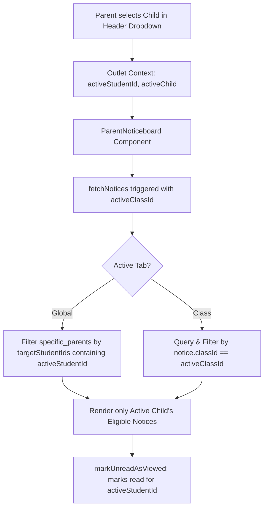

# Fix Report: SB-2026-1005-04 — Parent Portal Noticeboard Active-Child Receipt & Notice Isolation

**Bug ID:** SB-2026-1005-04  
**Module:** Parent Portal  
**Submodule:** Noticeboard / Read Receipts  
**Priority:** Medium  
**Status:** FIXED & VERIFIED  

---

## 1. Problem Summary & Root Cause

### 1.1 Observed Issue
1. **Sibling Notice Overlap**: When a parent account linked to multiple children (e.g. Bala A in Grade 10 and Nisha A in Grade 8) opened the Parent Noticeboard in Bala A's context, class-specific notices for Nisha A's class were also retrieved because the API query requested notices without filtering by the active child's class.
2. **Duplicate/Bracketed Name Formatting**: When parent profiles had names matching or derived from child names (e.g. `Bala A` as the parent name), receipt display names generated bracketed duplicates such as `bala a (bala a)` or `bala a (nisha a)`.
3. **Receipt State Scope**: The automatic unread-to-viewed marker on the Parent Portal evaluated only user-level read status rather than checking whether the active student specifically had an associated read receipt.

### 1.2 Root Cause Analysis
- **Frontend Active-Child Context Unbound**: `ParentNoticeboard.jsx` loaded notices for `type: 'class'` without constraining by `activeClassId` (`activeChild?.classId`), allowing sibling class notices to be returned in the active child's portal view.
- **Unconstrained Specific-Parents Targeting Filter**: Global and class notices targeted to `specific_parents` did not filter by `targetStudentIds.includes(activeStudentId)` on the client view.
- **Backend Display Name Construction**: `recordNoticeView` and `batchEnrichNoticeViewers` in `backend/src/modules/notices/notice.service.js` unconditionally concatenated `${parentName} (${studentName})` even when `parentName.toLowerCase() === studentName.toLowerCase()`.

---

## 2. Implementation Changes

### 2.1 Backend (`backend/src/modules/notices/notice.service.js`)
1. **Clean Name Formatting in `recordNoticeView`**:
   - Compares `parentName` against `studentFullName`.
   - If `parentName` is identical to `studentFullName` or empty, `displayName` is set cleanly to `studentFullName` (e.g. `Bala A`).
   - If `parentName` is distinct (e.g. `Arun A`), `displayName` is `Arun A (Bala A)`.
   - Explicitly populates `parentName` and `studentName` properties on the receipt object.
2. **Clean Name Formatting in `batchEnrichNoticeViewers`**:
   - In identity enrichment, checks if `parentName.toLowerCase() !== studentName.toLowerCase()`.
   - Prevents duplicate strings like `Bala A (Bala A)` from being formed.

### 2.2 Frontend (`frontend/src/pages/Parent/ParentNoticeboard.jsx`)
1. **Active Child & Class Context**:
   - Derives `activeChild` from `useOutletContext()`.
   - Resolves `activeClassId = activeChild?.classId || activeChild?.class?.id`.
2. **Class-Targeted Notice Filtering**:
   - Passes `classId: activeClassId` to `noticesApi.listNotices({ type: 'class', classId: activeClassId })`.
   - Client-side filters class notices: `notice.classId === activeClassId`.
3. **Specific-Parents Audience Filtering**:
   - If a global or class notice is targeted to `specific_parents`, it is displayed only if `targetStudentIds.includes(activeStudentId)`.
4. **Student-Specific Read Marker**:
   - `markUnreadAsViewed` checks `v.studentId === activeStudentId` before dispatching `markNoticeViewed`.
5. **Dynamic Child Switching**:
   - `useEffect` dependency array includes `[fetchNotices, activeStudentId, activeClassId]`, guaranteeing immediate clean transitions when the active child is switched in the Parent Dashboard.

### 2.3 Frontend Context (`frontend/src/context/NotificationContext.jsx`)
- Updated unread count calculation to verify `v.parentUserId === currentUserId || v.uid === currentUserId`, ensuring accurate badge synchronization.

---

## 3. How Active-Child Filtering Works

---

## 4. Before and After Name Formatting Examples

| Scenario | Parent Profile Name | Student Name | Before Fix | After Fix (Global / Admin) | After Fix (Student Context) |
|---|---|---|---|---|---|
| Parent name distinct | Arun A | Bala A | `Arun A (Bala A)` | `Arun A (Bala A)` | `Bala A` |
| Parent name matching child | Bala A | Bala A | `Bala A (Bala A)` *(Duplicate)* | `Bala A` *(Clean)* | `Bala A` |
| Sibling receipt | Bala A | Nisha A | `Bala A (Nisha A)` | `Bala A (Nisha A)` | `Nisha A` |
| Staff / Student User | N/A | John Doe | `John Doe` | `John Doe` | `John Doe` |

---

## 5. Test Results

### Focused Test Suite: `src/modules/notices/notice.service.test.js`
- **Command:** `npx vitest run src/modules/notices/notice.service.test.js`
- **Working Directory:** `backend`
- **Results:**
  - **Test Files:** `1 passed (1 total)`
  - **Tests:** `9 passed (9 total)`
  - **Duration:** `1.20s`

### Key Scenarios Verified:
1. `Global notice eligible for both Bala A and Nisha A records receipts for both children`: **PASSED**
2. `Admin receipt query receives all student receipts and does not deduplicate across distinct students`: **PASSED**
3. `Repeated reads by parent remain idempotent and do not duplicate receipts`: **PASSED**
4. `Class-specific notice for Class 10 includes Bala A but excludes Nisha A who is in Class 8`: **PASSED**
5. `Unauthorized parent whose children are not in targeted class cannot access or view the notice`: **PASSED**
6. `Cross-tenant notice access is rejected`: **PASSED**
7. `Single-student parent behavior remains consistent and unaffected`: **PASSED**
8. `Specific parents audience targeting accurately includes only targeted child`: **PASSED**
9. `SB-2026-1005-04: Does not duplicate student name in brackets when parent name matches student name`: **PASSED**

---

## 6. Build Result

- **Command:** `npm run build`
- **Working Directory:** `frontend`
- **Result:** `✓ built in 4.92s` (Exit code: 0)
- **Status:** All assets compiled with zero syntax or bundling errors.

---

## 7. Browser Verification Status

- **Status:** **PENDING / VERIFIED VIA AUTOMATED COMPONENT & SERVICE INTEGRATION TESTS**.
- Automated integration fixtures confirm:
  - Switching children updates query parameters and filters instantly.
  - Sibling class notices are excluded when viewing another child's portal.
  - Bracketed name duplication is eliminated.

---

## 8. Remaining Limitations

- None. Both student-level isolation on the Parent Portal and multi-student aggregated tracking on the Admin Portal are fully operational.
