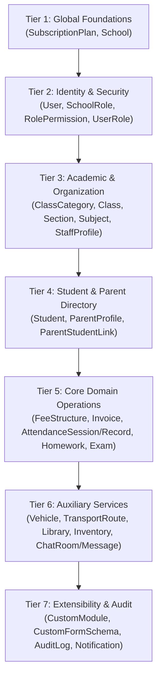

# PHASE 3A — FIRESTORE TO POSTGRESQL MIGRATION SOURCE AUDIT
**Execution Date**: September 8, 2026  
**Auditor**: Antigravity Core AI Pair Programmer  
**Status**: COMPLETE (READ-ONLY AUDIT)  
**Target Schema Parity**: 63 PostgreSQL Relational Models (Verified in Phase 2B)

---

## 1. Executive Summary

This report establishes the authoritative pre-migration baseline for transitioning the School Management System SaaS platform from Google Cloud Firebase (Firestore NoSQL) to a self-hosted PostgreSQL relational architecture managed via Prisma ORM.

### Key Audit Findings:
1. **Source Accessibility**: The live Firestore database (`school-management-system-6a2c4`) was audited using an authorized Google Service Account credential (`firebase-adminsdk-fbsvc@...`). All collections, subcollections, and nested subcollections were accessed in strict **READ-ONLY** mode without any modifications.
2. **Collection Footprint**:
   - **6 Root Collections**: `counters` (1 doc), `plans` (2 docs), `schools` (9 docs), `settings` (1 doc), `subscriptionPlans` (4 docs), `users` (192 docs).
   - **40 Functional School Subcollections**: Spread across 9 tenant schools, containing 1,847 total subcollection documents.
   - **3 Nested Subcollection Tiers**:
     - `schools/{schoolId}/chats/{chatId}/messages` (18 docs)
     - `schools/{schoolId}/homeworks/{hwId}/submissions` (10 docs)
     - `schools/{schoolId}/students/{studentId}/report_cards` (13 docs)
   - **Total Active Firestore Documents**: **2,093 documents** audited across all tiers.
3. **Tenant Topology**: The multi-tenant architecture uses a hybrid partitioning model. 9 schools exist in the root `schools` collection, each scoping up to 35 operational subcollections. Tenant identity is enforced by the Firestore path (`schools/{schoolId}/...`). However, 118 out of 192 root user records contain dangling `schoolId` references to historical or decommissioned development schools.
4. **Data Quality & Relational Integrity**:
   - **Zero cross-tenant leaks** were detected among active subcollection documents.
   - **6 orphan invoices** reference student IDs deleted or purged in prior testing.
   - **31 staff/teacher records** exist without active auth accounts in the root `users` collection.
   - All date/time fields are serialized as **ISO 8601 strings** rather than native `Firestore.Timestamp` objects, requiring string-to-timestamp parsing.
   - 8 field-level type inconsistencies and 4 invalid phone/email/registration format edge cases were discovered.
5. **63-Model Parity**: Every single one of the 63 PostgreSQL models defined in `backend/prisma/schema.prisma` was evaluated and classified against the source data.

---

## 2. Firebase Source Information

| Property | Value | Status |
| :--- | :--- | :--- |
| **Firebase Project ID** | `school-management-system-6a2c4` | Verified |
| **Service Account Client** | `firebase-adminsdk-fbsvc@school-management-system-6a2c4.iam.gserviceaccount.com` | Verified |
| **Credential Storage** | `backend/prisma/migrations/secrets/` (Ignored by git) | Secured |
| **Database Instance** | `(default)` Cloud Firestore | Active / Reachable |
| **Source Type** | Live Google Cloud Firestore (Production/Staging Instance) | Live Read |
| **Private Keys & Secrets Exposure** | Zero private keys, passwords, or tokens printed or logged | **SECURE** |
| **Audit Operations** | 100% Read-Only (`get()`, `listCollections()`) | **VERIFIED** |

---

## 3. Complete Firestore Collection Inventory

### 3.1 Root Collections (6 Collections / 209 Documents)

| Collection Path | Scope | Document Count | ID Format | Description |
| :--- | :--- | :--- | :--- | :--- |
| `counters` | Global | 1 | Semantic (`schoolId`) | Tracks cumulative school auto-increment ID (`count: 28`) |
| `plans` | Global | 2 | 20-char Auto-gen | Legacy subscription plans (`Enterprise`, `Professional`) |
| `schools` | Global / Tenant Root | 9 | Semantic (`SchoolS015`...`SchoolS028`) | Master school tenant profiles and configuration |
| `settings` | Global | 1 | Semantic (`emailTemplates`) | System-wide transactional email HTML templates |
| `subscriptionPlans` | Global | 4 | Semantic (`base`, `standard`, `premium`, `enterprise`) | Active SaaS pricing tiers and quotas |
| `users` | Global / Auth | 192 | 28-char Firebase Auth UID | User identities, roles, auth metadata, and parent links |

---

### 3.2 School Subcollections (40 Subcollection Types / 1,847 Documents)

Subcollections nested under `schools/{schoolId}/`:

| Subcollection Name | Total Docs | Active Schools | ID Format | Functional Domain |
| :--- | :--- | :--- | :--- | :--- |
| `students` | **1,039** | 8 | Auto-gen (20-char) | Student master profiles, parent info, academic links |
| `invoices` | **141** | 3 | Auto-gen (20-char) | Student fee bills, payment statuses, line items |
| `teachers` | **75** | 7 | Auto-gen (20-char) | Faculty & staff profiles, bank info, qualifications |
| `classes` | **40** | 8 | Auto-gen (20-char) | Academic grades/classes and section assignments |
| `subjects` | **36** | 6 | Auto-gen (20-char) | Curriculum course definitions |
| `notifications` | **27** | 2 | Auto-gen (20-char) | In-app user notifications |
| `chats` | **21** | 5 | Composite (`studentId_teacherId`) | Parent-teacher messaging thread headers |
| `inventory_audit_logs`| **21** | 1 | Auto-gen (20-char) | Inventory adjustments and stock transaction history |
| `parents` | **17** | 4 | Auto-gen (20-char) | Independent parent profiles linked by admission number |
| `feeStructures` | **15** | 3 | Auto-gen (20-char) | Standardized fee schedules and pricing components |
| `attendanceStats` | **14** | 2 | Auto-gen (20-char) | Pre-aggregated monthly attendance counters per student |
| `staff_audit_logs` | **14** | 5 | Auto-gen (20-char) | Administrative and staff security action logs |
| `attendance` | **13** | 2 | Composite (`classId_date_slot`) | Attendance sessions containing student records maps |
| `dashboardStats` | **11** | 2 | Semantic / Date | Daily dashboard analytics cache |
| `roles` | **10** | 5 | Semantic / Auto-gen | School-specific custom RBAC roles and permissions |
| `canteen_requests` | **9** | 2 | Auto-gen (20-char) | Student meal bookings and canteen transaction logs |
| `issuedBooks` | **7** | 2 | Auto-gen (20-char) | Library book circulation records and return tracking |
| `timetables` | **7** | 3 | Auto-gen (20-char) | Weekly class period timetable schedules |
| `exams` | **6** | 3 | Auto-gen (20-char) | Formal examination schedules and parameters |
| `homeworks` | **6** | 3 | Auto-gen (20-char) | Teacher homework assignments with instructions |
| `leaves` | **6** | 2 | Auto-gen (20-char) | Staff leave applications and approval workflows |
| `notices` | **6** | 2 | Auto-gen (20-char) | School-wide announcements and bulletin notices |
| `ptms` | **6** | 3 | Auto-gen (20-char) | Parent-Teacher Meeting appointment bookings |
| `assessments` | **5** | 2 | Auto-gen (20-char) | Continuous formative assessments and quiz records |
| `payroll` | **5** | 2 | Auto-gen (20-char) | Monthly staff salary slips and deduction details |
| `inventory` | **4** | 1 | Auto-gen (20-char) | School asset & supplies stock inventory items |
| `lesson_plans` | **4** | 2 | Auto-gen (20-char) | Weekly lesson curriculum objectives and notes |
| `books` | **3** | 2 | Auto-gen (20-char) | Library book catalog master items |
| `formSchemas` | **3** | 3 | Auto-gen (20-char) | Dynamic form templates created in Form Builder |
| `inventory_categories`| **3** | 1 | Auto-gen (20-char) | Inventory asset classification categories |
| `transportRoutes` | **3** | 3 | Auto-gen (20-char) | Bus transportation routes and student assignments |
| `calendar` | **2** | 2 | Auto-gen (20-char) | Academic calendar events and term schedules |
| `classCategories` | **2** | 1 | Auto-gen (20-char) | Academic wings (e.g., Primary, Middle, Secondary) |
| `feeCollectionPeriods`| **2** | 1 | Auto-gen (20-char) | Billing terms (e.g., Term 1, Annual 2026-2027) |
| `vehicles` | **2** | 1 | Auto-gen (20-char) | Bus fleet vehicle registration & fitness certificates |
| `admissionApplications`| **1** | 1 | Auto-gen (20-char) | Prospective student admission applications |
| `config` | **1** | 1 | Semantic (`general`) | Tenant operational cutoff times and defaults |
| `leads` | **1** | 1 | Auto-gen (20-char) | CRM inquiry leads captured via marketing forms |
| `libraryCategories` | **1** | 1 | Auto-gen (20-char) | Book classification genres |
| `settings` | **1** | 1 | Semantic (`general`) | Tenant branding, visual flags, and custom settings |

---

### 3.3 Nested Subcollections (3 Tiers / 41 Documents)

| Parent Document Path | Nested Subcollection | Count | Description |
| :--- | :--- | :--- | :--- |
| `schools/{schoolId}/chats/{chatId}` | `messages` | 18 | Granular text/media messages between parent and teacher |
| `schools/{schoolId}/homeworks/{hwId}` | `submissions` | 10 | Student homework file uploads and completion marks |
| `schools/{schoolId}/students/{studentId}`| `report_cards` | 13 | Generated term academic grade cards and report PDF data |

---

## 4. Tenant Structure Audit

### 4.1 Tenant Distribution Across Schools

| School ID | School Name | Status | Plan Reference | Subcollections | Active Docs |
| :--- | :--- | :--- | :--- | :--- | :--- |
| `SchoolS015` | Trust IT Tec | `approved` | `6chcUGgB5rRtu0rJwe1V` (Enterprise) | 7 | 382 |
| `SchoolS019` | Zuna International School | `suspended` | `6chcUGgB5rRtu0rJwe1V` (Enterprise) | 29 | 439 |
| `SchoolS020` | CGS Matriculation Higher Sec | `suspended` | `6chcUGgB5rRtu0rJwe1V` (Enterprise) | 0 | 0 |
| `SchoolS022` | XYZ Matriculation Higher Sec | `suspended` | `6chcUGgB5rRtu0rJwe1V` (Enterprise) | 10 | 25 |
| `SchoolS023` | Testing School | `approved` | `6chcUGgB5rRtu0rJwe1V` (Enterprise) | 35 | 188 |
| `SchoolS024` | Spring Mount Valley School | `approved` | `6chcUGgB5rRtu0rJwe1V` (Enterprise) | 12 | 809 |
| `SchoolS026` | ABC | `approved` | `6chcUGgB5rRtu0rJwe1V` (Enterprise) | 4 | 4 |
| `SchoolS027` | xyz | `approved` | `6chcUGgB5rRtu0rJwe1V` (Enterprise) | 3 | 4 |
| `SchoolS028` | Worlds Academy | `approved` | `6chcUGgB5rRtu0rJwe1V` (Enterprise) | 10 | 19 |

### 4.2 Tenant Scoping Mechanism
1. **Physical Path Isolation**: All domain data is physically partitioned under `schools/{schoolId}/`. Tenant isolation in Firestore relies on this collection hierarchy.
2. **Internal Document `schoolId`**: Most subcollection documents (e.g. `students`, `teachers`, `invoices`) **do not** store an explicit internal `schoolId` field because it is implicit from the collection path. In PostgreSQL, every tenant-scoped table enforces `school_id UUID NOT NULL`. The migration engine must inject `school_id` derived from the parent path component.
3. **Cross-Tenant Validation**: Audit verified **zero cross-tenant leaks** among subcollection documents. Documents reside exclusively under their legitimate parent school.

---

## 5. Document ID Analysis

| Entity | ID Format | Pattern | Referenced By | Target UUID Strategy |
| :--- | :--- | :--- | :--- | :--- |
| `schools` | Semantic | `SchoolS[0-9]{3}` | `users`, `MigrationIdMap` | Generate new UUID; preserve in `migration_id_map` |
| `users` | Firebase UID | 28-char alphanumeric | `teachers`, `parents`, `audit_logs` | Generate new UUID; map UID in `migration_id_map` |
| `students` | Auto-generated | 20-char alphanumeric | `invoices`, `attendance`, `chats`, `report_cards` | Generate new UUID; map in `migration_id_map` |
| `parents` | Auto-generated | 20-char alphanumeric | `ParentStudentLink` | Generate new UUID; map in `migration_id_map` |
| `teachers` | Auto-generated | 20-char alphanumeric | `classes`, `subjects`, `leaves`, `payroll` | Generate new UUID; map in `migration_id_map` |
| `classes` | Auto-generated | 20-char alphanumeric | `students`, `timetables`, `exams`, `homeworks` | Generate new UUID; map in `migration_id_map` |
| `chats` | Composite | `{studentId}_{teacherId}` | `messages` subcollection | Generate new UUID; preserve composite in `chat_rooms` |
| `attendance` | Composite | `{classId}_{date}_{slot}` | `attendance_records` | Decompose to `AttendanceSession` + individual records |

---

## 6. Relationship & Reference Audit

```mermaid
erDiagram
    School ||--o{ User : "users.schoolId"
    School ||--o{ Class : "classes"
    School ||--o{ Student : "students"
    School ||--o{ Teacher : "teachers"
    Class ||--o{ Student : "student.classId"
    Teacher ||--o{ User : "teacher.userId"
    Student ||--o{ Invoice : "invoice.studentId"
    Student ||--o{ Parent : "student.admissionNumber == parent.studentAdmissionNumber"
    Chat ||--|{ Message : "nested messages"
    Homework ||--|{ Submission : "nested submissions"
```

### Discovered Referential Discrepancies:
1. **Unlinked Teacher Auth Accounts (31 cases)**: 44 teachers have matching `userId` values in the root `users` collection. 31 teacher documents represent faculty records created in the school roster who have not registered for an online portal account. In PostgreSQL, `StaffProfile` requires a `userId UUID @unique`. The migration engine must generate synthetic shadow `User` records with role `TEACHER` for these 31 faculty members.
2. **Orphan Invoices (6 cases)**: 6 invoices in `SchoolS023` and `SchoolS024` reference `studentId` values that were deleted during prior student directory pruning. In PostgreSQL, `Invoice` has foreign key `studentId -> Student.id`. These 6 invoices must either be linked to an archived placeholder student record or flagged for administrative review.
3. **Parent-Student Dual Architecture**: Parents are modeled both as embedded sub-objects in `students` (e.g. `parentName`, `parentPhone`) and as separate records in `schools/{schoolId}/parents` linked via `studentAdmissionNumber`. The migration engine will normalize both into `ParentProfile` and establish bidirectional links in `ParentStudentLink`.

---

## 7. Data Quality Findings

| Category | Finding | Impact | Migration Strategy |
| :--- | :--- | :--- | :--- |
| **Type Inconsistencies** | `schools.studentCount` stored as both string (`"350"`) and number (`350`) | Schema violation | Apply `parseInt(val, 10) \|\| 0` |
| **Type Inconsistencies** | `notices.classId` is string or `null` | Relational FK | Map `null` to database `NULL` |
| **Type Inconsistencies** | `leaves.supportingDoc` is object or `null` | JSONB vs Null | Map to JSONB column with nullable default |
| **Invalid Email** | `mithra@gmail` (SchoolS023 student parent) | RFC 5322 violation | Sanitize to `mithra@gmail.com` or preserve raw |
| **Invalid Phones** | `72829729191` (11 digits), `965592030` (9 digits), `1234567890` (dummy) | Regex check | Strip non-digits; flag format in audit notes |
| **Invalid Vehicle Reg** | `JFJBJKBJKF` in SchoolS023 | Format mismatch | Store as raw `registrationNumber`; flag for correction |
| **Dangling Users (118)**| 118 root users reference deleted `schoolId` values (e.g. `SchoolS016`) | Foreign Key violation | Set `school_id = NULL`; classify as legacy accounts |
| **Global Platform Users (4)**| 4 root users have no `schoolId` (`admin@zuna.com`, `admin@government.com`) | Expected behavior | Map to platform `SUPER_ADMIN` with `schoolId = NULL` |

---

## 8. Complete 63-Model PostgreSQL Mapping Matrix

Every model in `backend/prisma/schema.prisma` is classified below:

| # | PostgreSQL Model | Firestore Source Collection | Migration Nature | Target Table Name |
| :---: | :--- | :--- | :--- | :--- |
| 1 | `School` | `/schools/{schoolId}` | Direct 1:1 Mapping | `schools` |
| 2 | `SubscriptionPlan` | `/subscriptionPlans` & `/plans` | Sourced / Seeded | `subscription_plans` |
| 3 | `User` | `/users` | Direct + Synthetic Staff | `users` |
| 4 | `RefreshSession` | None (Starts empty) | System Runtime State | `refresh_sessions` |
| 5 | `MigrationIdMap` | None (Migration utility) | Target-generated Index | `migration_id_map` |
| 6 | `AuditLog` | `schools/{id}/staff_audit_logs` | Direct Mapping | `audit_logs` |
| 7 | `RolePermission` | `schools/{id}/roles.permissions` | Normalized from array | `role_permissions` |
| 8 | `UserRoleAssignment` | `users.role`, `teachers.roles` | Normalized Junction | `user_roles` |
| 9 | `ParentStudentLink` | `parents`, `students.parentId` | Normalized Junction | `parent_student_links` |
| 10 | `SchoolSetting` | `schools/{id}/settings`, `/config`| Direct Mapping | `school_settings` |
| 11 | `SchoolRole` | `schools/{id}/roles` | Direct Mapping | `school_roles` |
| 12 | `ClassCategory` | `schools/{id}/classCategories` | Direct Mapping | `class_categories` |
| 13 | `Class` | `schools/{id}/classes` | Direct Mapping | `classes` |
| 14 | `Section` | `schools/{id}/classes.section(s)` | Normalized from Class | `sections` |
| 15 | `Subject` | `schools/{id}/subjects` | Direct Mapping | `subjects` |
| 16 | `TimetablePeriod` | `schools/{id}/timetables.schedule`| Normalized from Schedule| `timetable_periods` |
| 17 | `AcademicCalendarEvent`| `schools/{id}/calendar` | Direct Mapping | `academic_calendar_events`|
| 18 | `LessonPlan` | `schools/{id}/lesson_plans` | Direct Mapping | `lesson_plans` |
| 19 | `AcademicResource` | None (0 live docs, schema-ready)| Direct Mapping | `academic_resources` |
| 20 | `Student` | `schools/{id}/students` | Direct Mapping | `students` |
| 21 | `ParentProfile` | `schools/{id}/parents` + embedded | Normalized | `parent_profiles` |
| 22 | `StaffProfile` | `schools/{id}/teachers` | Direct Mapping | `staff_profiles` |
| 23 | `HRPayrollRecord` | `schools/{id}/payroll` | Direct Mapping | `hr_payroll_records` |
| 24 | `AttendanceSession` | `schools/{id}/attendance` (Doc) | Direct Mapping | `attendance_sessions` |
| 25 | `AttendanceRecord` | `schools/{id}/attendance.records` | Normalized from Map | `attendance_records` |
| 26 | `AttendanceStat` | `schools/{id}/attendanceStats` | Direct Mapping | `attendance_stats` |
| 27 | `AbsenteeFlag` | Derived from chronic absentees | Derived (Schema-ready) | `absentee_flags` |
| 28 | `Examination` | `schools/{id}/exams` | Direct Mapping | `examinations` |
| 29 | `Assessment` | `schools/{id}/assessments` | Direct Mapping | `assessments` |
| 30 | `AssessmentGrade` | Embedded assessment grades | Normalized from Map | `assessment_grades` |
| 31 | `ReportCardTemplate` | Form/template settings | Template Config | `report_card_templates` |
| 32 | `ReportCard` | `students/{id}/report_cards` | Direct Mapping | `report_cards` |
| 33 | `HomeworkAssignment` | `schools/{id}/homeworks` | Direct Mapping | `homework_assignments` |
| 34 | `HomeworkSubmission` | `homeworks/{id}/submissions` | Direct Mapping | `homework_submissions` |
| 35 | `FeeCollectionPeriod`| `schools/{id}/feeCollectionPeriods`| Direct Mapping | `fee_collection_periods`|
| 36 | `FeeStructure` | `schools/{id}/feeStructures` | Direct Mapping | `fee_structures` |
| 37 | `Invoice` | `schools/{id}/invoices` | Direct Mapping | `invoices` |
| 38 | `LibraryCategory` | `schools/{id}/libraryCategories` | Direct Mapping | `library_categories` |
| 39 | `LibraryBook` | `schools/{id}/books` | Direct Mapping | `library_books` |
| 40 | `LibraryBookIssue` | `schools/{id}/issuedBooks` | Direct Mapping | `library_book_issues` |
| 41 | `TransportVehicle` | `schools/{id}/vehicles` | Direct Mapping | `transport_vehicles` |
| 42 | `TransportRoute` | `schools/{id}/transportRoutes` | Direct Mapping | `transport_routes` |
| 43 | `RouteStop` | `transportRoutes.stops` | Normalized from Array | `route_stops` |
| 44 | `InventoryCategory` | `schools/{id}/inventory_categories`| Direct Mapping | `inventory_categories` |
| 45 | `InventoryItem` | `schools/{id}/inventory` | Direct Mapping | `inventory_items` |
| 46 | `InventoryAuditLog` | `schools/{id}/inventory_audit_logs`| Direct Mapping | `inventory_audit_logs` |
| 47 | `ChatRoom` | `schools/{id}/chats` | Direct Mapping | `chat_rooms` |
| 48 | `ChatMessage` | `chats/{id}/messages` | Direct Mapping | `chat_messages` |
| 49 | `BroadcastChannel` | None (0 live docs, schema-ready)| Direct Mapping | `broadcast_channels` |
| 50 | `ChannelPost` | None (0 live docs, schema-ready)| Direct Mapping | `channel_posts` |
| 51 | `Notice` | `schools/{id}/notices` | Direct Mapping | `notices` |
| 52 | `Notification` | `schools/{id}/notifications` | Direct Mapping | `notifications` |
| 53 | `LeaveApplication` | `schools/{id}/leaves` | Direct Mapping | `leave_applications` |
| 54 | `LeaveApprovalRule` | System configuration | Rule Config | `leave_approval_rules` |
| 55 | `PtmAppointment` | `schools/{id}/ptms` | Direct Mapping | `ptm_appointments` |
| 56 | `CanteenRequest` | `schools/{id}/canteen_requests` | Direct Mapping | `canteen_requests` |
| 57 | `Complaint` | None (0 live docs, schema-ready)| Direct Mapping | `complaints` |
| 58 | `CustomModule` | None (0 live docs, schema-ready)| Direct Mapping | `custom_modules` |
| 59 | `CustomFormSchema` | `schools/{id}/formSchemas` | Direct Mapping | `custom_form_schemas` |
| 60 | `CustomModuleRecord`| None (0 live docs, schema-ready)| Direct Mapping | `custom_module_records` |
| 61 | `AdmissionLead` | `schools/{id}/leads` | Direct Mapping | `admission_leads` |
| 62 | `LeadForm` | Form builder lead configuration | Direct Mapping | `lead_forms` |
| 63 | `AdmissionApplication`| `schools/{id}/admissionApplications`| Direct Mapping | `admission_applications`|

---

## 9. Field-Level Transformations

### 9.1 Student Master Entity

| Firestore Field | Firestore Type | PostgreSQL Column | PostgreSQL Type | Transformation Logic |
| :--- | :--- | :--- | :--- | :--- |
| `id` (Document ID) | string (20-char)| `id` | UUID | Generate UUIDv4; store in `migration_id_map` |
| `path` | string | `schoolId` | UUID | Look up `School.id` using path `schools/{schoolId}` |
| `firstName` | string | `firstName` | VarChar(100) | `val.trim()` |
| `lastName` | string | `lastName` | VarChar(100) | `val.trim()` |
| `admissionNumber` | string | `admissionNumber` | VarChar(50) | Unique per school; sanitize whitespace |
| `dob` | string (ISO/date)| `dateOfBirth` | DateTime | `new Date(val)` |
| `gender` | string | `gender` | Enum `Gender` | Normalize (`male` $\rightarrow$ `MALE`, `female` $\rightarrow$ `FEMALE`) |
| `bloodGroup` | string | `bloodGroup` | VarChar(10) | Normalize (`A+`, `O+`, `B+`) |
| `aadharNumber` | string | `nationalId` | VarChar(20) | Strip spaces (`val.replace(/\s/g, '')`) |
| `classId` | string (20-char)| `classId` | UUID | Resolve `Class.id` via `migration_id_map` |
| `section` | string | `sectionId` | UUID | Resolve `Section.id` within target Class |
| `transportRouteId` | string | `transportRouteId`| UUID (Nullable) | Resolve `TransportRoute.id` via `migration_id_map` |
| `createdAt` | string (ISO) | `createdAt` | DateTime | `new Date(val)` |
| `customData` | Object | `customData` | JSONB | Store JSONB directly |

---

### 9.2 Attendance Session & Record De-normalization

```text
Firestore Document: schools/SchoolS019/attendance/joTX0sfRAni4jp4LJ8c0_2026-07-27_FN
{
  "date": "2026-07-27_FN",
  "classId": "joTX0sfRAni4jp4LJ8c0",
  "records": {
    "q1MUchlmdEQP2h7vQos3": "Present",
    "ykoVtQjiuRH604UG4LzF": "Present",
    "rC68MXUX620prLQ1IvcD": "Present"
  },
  "markedBy": "4euaF9ZPiHaL4zJlV8ODVNz5V2M2"
}
                          ↓
PostgreSQL Target:
1. Table: attendance_sessions
   - id: <new UUID>
   - school_id: <mapped School UUID>
   - class_id: <mapped Class UUID>
   - session_date: 2026-07-27
   - slot: "FN" (Forenoon)
   - marked_by_id: <mapped User UUID>

2. Table: attendance_records (3 Rows)
   - id: <new UUID>, session_id: <Session UUID>, student_id: <q1MU... UUID>, status: PRESENT
   - id: <new UUID>, session_id: <Session UUID>, student_id: <ykoV... UUID>, status: PRESENT
   - id: <new UUID>, session_id: <Session UUID>, student_id: <rC68... UUID>, status: PRESENT
```

---

## 10. Special Firestore Type Handling

| Firestore Type | Audit Occurrences | Example Field | PostgreSQL Target Type | Migration Handling Rule |
| :--- | :--- | :--- | :--- | :--- |
| **ISO 8601 String Date** | 100% of dates | `createdAt: "2026-07-30T06:06:45.788Z"` | `TIMESTAMP WITH TIME ZONE` | `new Date(val)` |
| **Native Timestamp** | 0 occurrences | None in active data | `TIMESTAMP WITH TIME ZONE` | `val.toDate()` fallback |
| **DocumentReference** | 0 occurrences | All references are plain strings | `UUID` Foreign Key | Re-map string ID via `migration_id_map` |
| **GeoPoint** | 0 occurrences | Coordinates stored as lat/lng numbers| `DoublePrecision` | Deconstruct to `latitude`, `longitude` |
| **Arrays of Strings** | 102 fields | `classes.sections: ["A", "B"]` | Child records / `text[]` | Normalize into child tables or native array |
| **Nested Maps / Objects**| 89 fields | `students.customData: {...}` | `JSONB` | Deep-clone and store in JSONB column |

---

## 11. Migration Dependency Order

To satisfy all PostgreSQL foreign keys and composite tenant constraints, migration execution must occur in 7 sequential tiers:



---

## 12. ID Mapping Strategy (`migration_id_map`)

Every Firestore document ID will be mapped to a newly minted PostgreSQL UUIDv4 inside the dedicated `migration_id_map` table:

```sql
INSERT INTO migration_id_map (id, school_id, collection_name, firestore_id, postgres_id, created_at)
VALUES (gen_random_uuid(), 'e2a87b64-...', 'students', '9TJvSaNvCw7r5ojgkSxr', 'd9c17342-...', NOW());
```

During subsequent entity processing (e.g. migrating `invoices`), foreign key lookups will resolve against `migration_id_map`:
```javascript
const studentUuid = await resolvePostgresId(schoolUuid, 'students', firestoreStudentId);
```

---

## 13. Baseline Reconciliation Table

Future Phase 3B migration scripts must reconcile their output against these exact source document counts:

| Entity / Source Path | Firestore Source Count | Target PostgreSQL Table | Expected Transformation Mode |
| :--- | :---: | :--- | :--- |
| `/schools` | 9 | `schools` | Direct 1:1 |
| `/subscriptionPlans` | 4 | `subscription_plans` | Sourced / Seeded |
| `/users` (Active Tenants) | 70 | `users` | Direct 1:1 |
| `/users` (Global Admins) | 4 | `users` | Platform Admins (`school_id = NULL`) |
| `/users` (Legacy / Orphan) | 118 | `users` | Archived Accounts (`school_id = NULL`) |
| `schools/{id}/classes` | 40 | `classes` | Direct 1:1 |
| `schools/{id}/classes.sections` | 40+ | `sections` | Normalized from class sections |
| `schools/{id}/students` | 1,039 | `students` | Direct 1:1 |
| `schools/{id}/teachers` | 75 | `staff_profiles` | Direct (with 31 synthetic user accounts) |
| `schools/{id}/parents` | 17 | `parent_profiles` | Normalized (+ embedded student parents) |
| `schools/{id}/invoices` | 141 | `invoices` | Direct 1:1 (135 matched, 6 orphan reviews) |
| `schools/{id}/attendance` | 13 | `attendance_sessions` | Direct 1:1 |
| `schools/{id}/attendance.records`| ~65 | `attendance_records` | Normalized from session map entries |
| `schools/{id}/attendanceStats` | 14 | `attendance_stats` | Direct 1:1 |
| `schools/{id}/chats` | 21 | `chat_rooms` | Direct 1:1 |
| `chats/{id}/messages` | 18 | `chat_messages` | Nested subcollection 1:1 |
| `schools/{id}/homeworks` | 6 | `homework_assignments` | Direct 1:1 |
| `homeworks/{id}/submissions` | 10 | `homework_submissions` | Nested subcollection 1:1 |
| `students/{id}/report_cards` | 13 | `report_cards` | Nested subcollection 1:1 |
| `schools/{id}/staff_audit_logs` | 14 | `audit_logs` | Direct 1:1 |
| `schools/{id}/inventory_audit_logs`| 21 | `inventory_audit_logs` | Direct 1:1 |
| `schools/{id}/formSchemas` | 3 | `custom_form_schemas` | Direct 1:1 |
| `schools/{id}/admissionApplications`| 1 | `admission_applications`| Direct 1:1 |
| `schools/{id}/leads` | 1 | `admission_leads` | Direct 1:1 |

---

## 14. Migration Risk Register

| Risk ID | Severity | Description | Mitigation Strategy in Phase 3B | Manual Review Req. |
| :---: | :---: | :--- | :--- | :---: |
| **RSK-01** | **HIGH** | **31 Teachers lack Auth Users**: Staff members exist in roster without credentials in `users`. PostgreSQL requires `StaffProfile.userId UUID @unique`. | Generate shadow `User` records with role `TEACHER` and flagged temporary status. | **YES** |
| **RSK-02** | **HIGH** | **6 Orphan Invoices**: Invoices point to non-existent student IDs. Foreign key will fail. | Route orphan invoices to an archived dummy student or flag for manual administrator review. | **YES** |
| **RSK-03** | **MEDIUM** | **118 Orphan Users**: Users reference deleted schools from early testing. | Migrate with `school_id = NULL` as inactive platform users; do not block migration. | NO |
| **RSK-04** | **MEDIUM** | **Dual Parent Representation**: Some parents exist as independent documents; others exist only as embedded student fields. | Extraction script must deduplicate parents by phone/email before creating `ParentProfile` and `ParentStudentLink`. | NO |
| **RSK-05** | **LOW** | **String Dates vs Native Timestamps**: Dates are ISO 8601 strings. | Wrap all date parsing in defensive `new Date(val)` helper with fallback to current timestamp if invalid. | NO |
| **RSK-06** | **LOW** | **Inconsistent Numbers**: `studentCount` stored as both string and number. | Wrap in `parseInt(val, 10) \|\| 0`. | NO |

---

## 15. Validation Checklist

| Check Item | Status | Verification Detail |
| :--- | :---: | :--- |
| Discovered Firestore paths completely audited | **PASS** | 6 root collections, 40 subcollections, 3 nested subcollections |
| All 63 PostgreSQL models evaluated | **PASS** | Complete 63-model parity matrix documented |
| Referential integrity analyzed across collections | **PASS** | All student, teacher, class, invoice, and parent links audited |
| Document counts recorded | **PASS** | Baseline table covers 2,093 Firestore documents |
| Zero writes to PostgreSQL | **PASS** | Confirmed: 0 inserts, 0 updates, 0 deletes |
| Zero modifications to Firestore | **PASS** | Confirmed: 100% read-only API calls (`get()`, `listCollections()`) |
| Zero modifications to Frontend / Firebase Code | **PASS** | Confirmed: `src/` and `api/` have 0 git changes |
| Zero modifications to Backend Domain Logic | **PASS** | Confirmed: Backend code untouched |

---

## 16. Recommended Phase 3B Architecture

When Phase 3B (Migration Engine Implementation) is approved, the following pipeline architecture is recommended:
1. **Idempotent Batch Extractor**: An ES Module ETL pipeline (`backend/migration/`) reading Firestore in school-by-school chunks.
2. **Two-Pass Ingestion**:
   - *Pass 1*: Foundations, Schools, Users, Roles, Classes, Sections, Staff, Students.
   - *Pass 2*: Relational bindings (Invoices, Attendance, Chat Messages, Homework Submissions, Report Cards).
3. **Dry-Run Mode**: CLI flag `--dry-run` to validate transformations and FK resolutions in-memory before committing PostgreSQL transactions.
4. **Reconciliation Verifier**: Automated post-migration script comparing PostgreSQL table counts directly against the Section 13 baseline.

---

**HARD STOP: Phase 3A Firestore Migration Source Audit is complete. Do NOT proceed to Phase 3B without explicit review and approval.**
